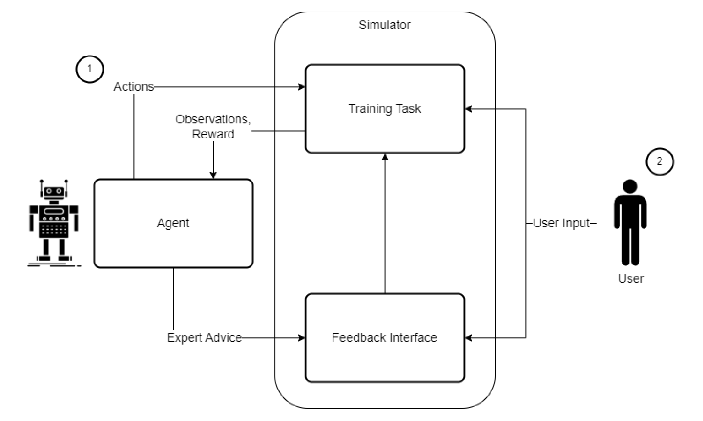
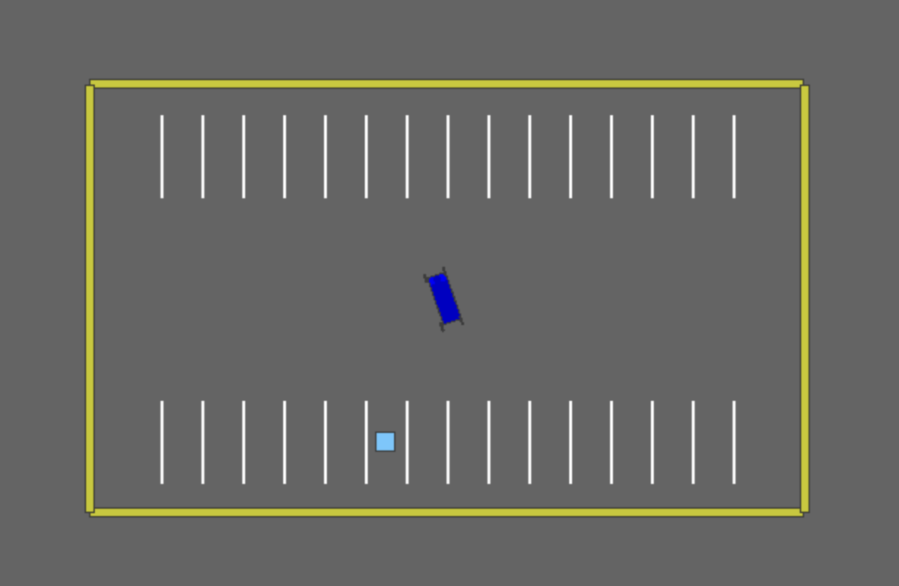
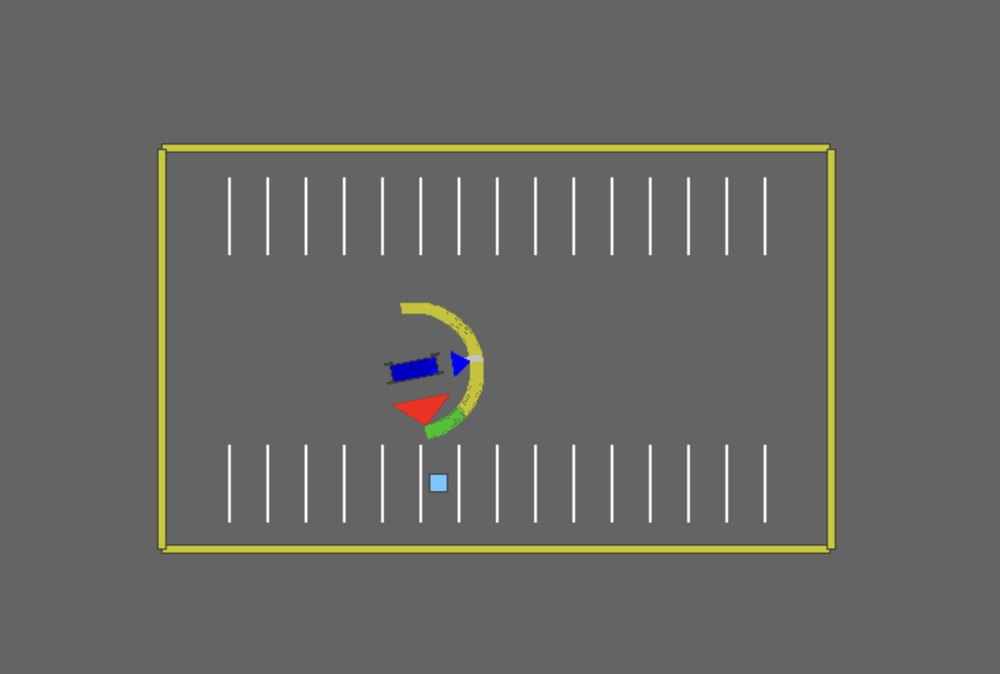
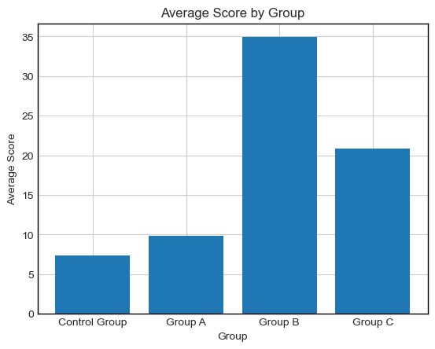
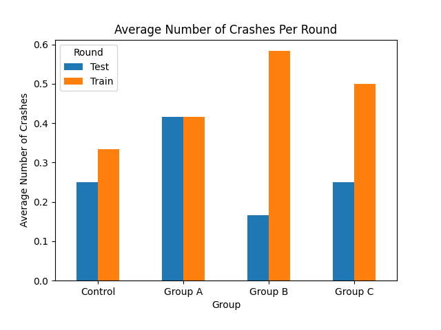
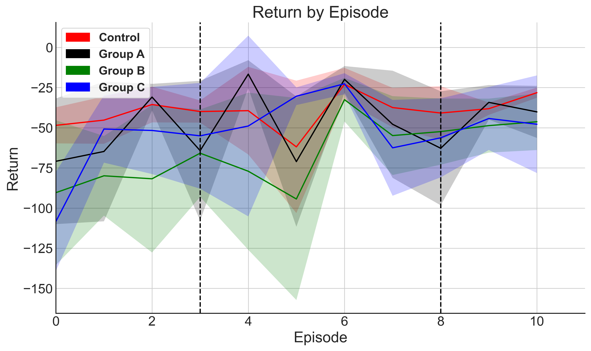
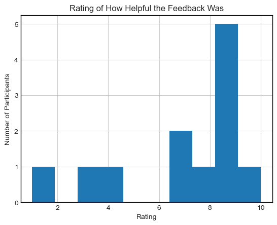
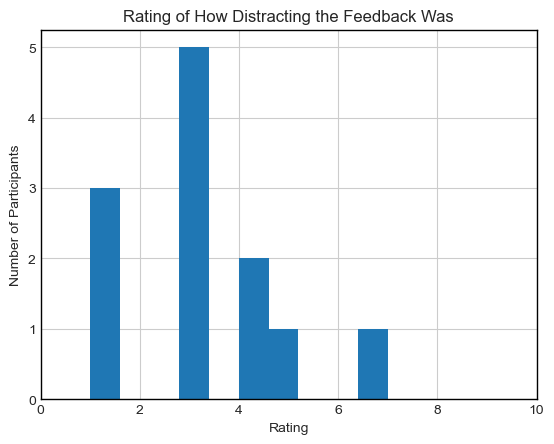

# Introduction

While human feedback has been explored to a great extent in the field of
human-in-the-loop reinforcement learning, agent feedback toward human
learners has been relatively unexplored. A reinforcement learning agent
learns from rewards through interaction with an environment. Human
feedback involves providing information to a reinforcement learning
agent during its training process to speed up learning. We focus on the
inverse: can humans learn quicker with feedback from an expert
reinforcement learning agent on complex tasks?

Our work aims to evaluate and extend the methods proposed by . Guevarra
proposed the use of reinforcement learning for formative feedback.
Reinforcement learning agents are trained on a specific task until they
are able to perform the task well. Then, while a human learner is
performing the same task, the agent’s actions are used to provide
feedback to the human. While this method was implemented by Guevarra on
two different tasks, its efficacy was not evaluated. Our work aims to
extend the method and evaluate it through a human subject study. Through
this, we hope to understand the real-world potential of reinforcement
learning for formative feedback.

# Background

We provide a brief overview of the technical details required to
understand our work.

## Formative Feedback

Schute defines formative feedback as “information communicated to the
learner that is intended to modify his or her thinking or behavior for
the purpose of improving learning". Schute further provides a framework
for categorizing types of formative feedback based on feedback
complexity.

In order for humans to learn from the feedback given by the
reinforcement learning agent, the feedback must be a form of formative
feedback. To this end, we employ the use of *correct response* feedback
in our study. Schute defines correct response feedback as “feedback that
informs the learner of the correct answer to a specific problem, with no
additional information".

In this study, we evaluate the effect of time on feedback by evaluating
feedback methods that fall under the “correct response" category but
with different feedback intervals.

## Reinforcement Learning

Reinforcement learning (RL) involves an agent learning to take the best
actions in an environment by maximizing a numerical reward signal . The
standard reinforcement learning cycle is shown in Figure
<a href="#fig:rl" data-reference-type="ref"
data-reference="fig:rl">1</a>. At each time step, the agent takes an
action. The environment receives the action and provides the agent with
an observation and a reward. The agent then uses the observation to
perform an action in the next time step.

<figure id="fig:rl">

<figcaption>Reinforcement learning loop where an agent interacts with an
environment by taking actions and receives rewards and observations
.</figcaption>
</figure>

## SAC

In this work we use *Soft Actor-Critic* (SAC) as our reinforcement
learning algorithm. We use SAC primarily because it was the same
algorithm used in Guevarra’s thesis.

Most reinforcement learning algorithms maximize the sum of expected
rewards:
∑*t*𝔼(*s**t*,*a**t*) ∼ *ρ**π*\[*r*(*s**t*,*a**t*)\]

SAC maximizes an alternative objective function which involves both the
reward *r* and *entropy* ℋ:

$$J(\pi) = \sum\_{t=0}^{\infty} \mathbb{E}\_{(s_t, a_t) \sim \rho\_{\pi}}\left\[r(s_t, a_t) + \alpha \mathcal{H}(\pi(\cdot\|s_t))\right\]$$

The addition of the entropy component in the objective provides
incentive for exploration .

## Providing Feedback Using an RL Agent

We use the feedback interface method proposed by (See
<a href="#fig:hitl" data-reference-type="ref"
data-reference="fig:hitl">2</a>). The RL agent is trained on the
training task until it reaches optimal performance. Then, once it is
trained, it is incorporated into the feedback loop with the human user.
As the human user interacts with the training task, they also interact
with the feedback interface. The feedback interface users the RL agent’s
best actions to deliver feedback to the human user. For instance, if the
human user performs an action significantly different from that of the
RL agent, the feedback interface might indicate the correct action to
the human.

<figure id="fig:hitl">

<figcaption>System for delivering RL feedback to a human user . The RL agent is
first trained on the training task. Then, while the human user is
interacting with the environment, the feedback interface uses the
agent’s best action to provide feedback to the human user.</figcaption>
</figure>

## Environment

We use the parking environment from the highway-env test suite for this
study. Figure <a href="#fig:env" data-reference-type="ref"
data-reference="fig:env">3</a> shows the environment. The goal is to
park the car in the parking space occupied by the blue square.

The observation space for the environment includes:

-   the position of the vehicle in 2D coordinates (x,y)

-   the velocity of the vehicle (vx, vy)

-   the cosine and sine of the vehicle’s heading angle: (*c**o**s*(*ϕ*),
    *s**i**n*(*ϕ*))

The action space for the environment was continuous. An action consisted
of two values: steering and acceleration. Both were bound to \[-1, 1\].

The reward was defined as
*r*(*s*,*a*) =  − ∥*s* − *s**g*∥*W*, *p**p* − *b*collision

where the current state is
*s* = \[*x*,*y*,*v**x*,*v**y*,*c**o**s*(*ϕ*),*s**i**n*(*ϕ*)\],
the goal state is
*s**g* = \[*x**g*, *y**g*, 0, 0, *c**o**s*(*ϕ**g*), *s**i**n*(*ϕ**g*),
$\lVert x \rVert\_{W, p} = \left(\sum\Vert W_ix_i \Vert^p\right)^{\frac{1}{p}}$,
and *b*collision is a collision penalty of 1 when the vehicle
crashes and a 0 otherwise.

### Setup for Human Interaction

We used the Logitech G29 wheel and pedal system for human input. The
rotation of the steering wheel was mapped to the steering action bounded
by \[-1, 1\]. The rightmost pedal was mapped to acceleration bounded by
\[0, 1\]. The middle pedal was mapped to acceleration bounded by \[-1,
0\]. The left pedal was not used.

We hoped that this interface would provide an additional layer of
difficulty that would make the environment a better learning task for a
human user, while still preserving the action space available to the
agent.

The reward for human users remained the same. It was not shown to the
human user and was instead used as a performance measure to evaluate
different feedback types.

<figure id="fig:env">

<figcaption>Parking environment within the highway-env test
suite.</figcaption>
</figure>

# Experimental Design

## Feedback Types

We use three different feedback types: real-time feedback, video
playback of the agent, video playback of both the human and then agent.

Our implementation of real time feedback was inspired by the feedback
from Guevarra’s study as shown in Figure
<a href="#fig:feedback" data-reference-type="ref"
data-reference="fig:feedback">4</a>.

We introduce two new feedback methods that provide feedback after an
episode is completed:

-   The video playback of the agent shows the optimal trajectory that
    the expert RL agent would have taken.

-   The video playback of both the human and the agent shows the
    trajectory of the human and the trajectory of the agent overlayed
    together.

<figure id="fig:feedback">

<figcaption>Real time feedback with directional (arc) and input (arrows)
indicators.</figcaption>
</figure>

## Human Subject Study

We use a human subject study to evaluate the different methods of
feedback. The study’s participants were divided into four different
groups as shown in  <a href="#tab:my_label" data-reference-type="ref"
data-reference="tab:my_label">1</a>.

Each group first completed three episodes with no feedback to learn the
basics of the task. Then, they completed five episodes with their
respective feedback type. Finally, they completed another three episodes
without feedback to evaluate their performance.

To measure change in performance, we take the difference in average
returns between the last three episodes and the first three episodes.
Thus the score for each participant would be denoted as:

$$\label{eq:score}
    \text{score} = \frac{1}{3}\sum\_{t = 1}^{3} G_t - \frac{1}{3}\sum\_{t = 14}^{16} G_t$$

where *G**t* represents the return of episode *t*.

We also asked the participants to fill out a form after the study in
order to evaluate each feedback type qualitatively. The form was
inspired by the NASA Task Load Index and seeks to evaluate the ease of
use of each type of feedback. The form also included questions about
demographic information such as previous driving and gaming experience.

| Group Name | Feedback Type                | Feedback Rate |
|:-----------|:-----------------------------|:--------------|
| Control    | No feedback                  | Never         |
| Group A    | Directional and input        | Real time     |
| Group B    | Video playback: agent        | Every episode |
| Group C    | Video playback: agent, human | Every episode |

Groups and their corresponding feedback types for the human subject
study

# Results

In order to evaluate the performance of the study participants we used
the score calculated using <a href="#eq:score" data-reference-type="ref"
data-reference="eq:score">[eq:score]</a>. We also examined the number of
crashes of the participants in each study group. It is important to note
that the study was conducted on a total of 16 participants where each
group had 4 participants each.

<figure id="fig:avgscore">

<figcaption>The average score for each feedback group. Score is
calculated using <a href="#eq:score" data-reference-type="ref"
data-reference="eq:score">[eq:score]</a>. Sample size <em>n</em> = 4 for each group.</figcaption>
</figure>

<figure id="fig:crashes">

<figcaption>The average number of crashes for each feedback group. The
blue bars are the averages for the first three warm up rounds, and the
orange bars indicate the last three testing rounds. Sample size <em>n</em> = 4 for each group.</figcaption>
</figure>

When looking at the average score, we see that Groups B and C seem to
perform better than the control group and group A (see
<a href="#fig:avgscore" data-reference-type="ref"
data-reference="fig:avgscore">5</a>). Additionally, examining the
average crashes per episode in each group, all groups other than group A
have a lower crash rate in the testing runs compared to the training
runs. This is especially apparent for groups B and C who saw a
significant decrease in crash rate during the testing runs. This might
potentially indicate that the participants responded better to episodic
feedback compared to real-time feedback.

While it might seem pretty evident that Groups B and C perform
significantly better than the other groups both in terms of score and
crashes, <a href="#fig:rewards" data-reference-type="ref"
data-reference="fig:rewards">7</a> tells a different story. It seems to
show that while there is very high variation in rewards in the first
eight episodes, the groups perform very similarly during the final three
test episodes. Furthermore, it is evident that the groups were biased in
terms of starting performance. Groups B and C had significantly worse
starting performance compared to the other groups, which explains their
significantly better average score.

<figure id="fig:rewards">

<figcaption>Return by episode for each feedback group. Shaded area
includes +/- 1 standard deviation from the mean. Sample size <em>n</em> = 4 for each group.</figcaption>
</figure>

The responses to our questionnaire indicate that the majority of
participants found the feedback helpful (See
<a href="#fig:helpful" data-reference-type="ref"
data-reference="fig:helpful">8</a>). Additionally the questionnaire also
indicated that the feedback was not distracting (See
<a href="#fig:distracting" data-reference-type="ref"
data-reference="fig:distracting">9</a>). The full list of questions can
be found in <a href="#app:questionnaire" data-reference-type="ref"
data-reference="app:questionnaire">8</a>.

<figure id="fig:helpful">

<figcaption>A histogram of responses to the question, "How helpful was
the feedback? (Did the feedback improve your performance on the task?)."
Control group participants were excluded from the histogram. Most
participants responded with a rating of five or above, indicating that
the feedback was helpful to them.</figcaption>
</figure>

<figure id="fig:distracting">

<figcaption>A histogram of responses to the question, "To what degree
did the feedback distract you from the task?" Control group participants
were excluded from the histogram. Most participants responded with a
rating of five or below, indicating that the feedback was not
distracting.</figcaption>
</figure>

# Discussion

We present a system that allows for the implementation, and evaluation
of different methods of formative feedback delivered to a human student
from an RL agent teacher. We also showed the effect that the rate of
feedback has on both user learning and experience. While the results of
our study might show that humans can benefit from an RL teacher through
a user study, especially when the feedback is given episodically, we
require further data to fully accept or reject this claim. We speculate
that the reason for humans responding better to episodic feedback might
involve the ability to focus and absorb information better when not
performing a difficult task.

If the claim is found to be true, the benefits of not fully relying on a
human teacher in these tasks is a reduction in cost to the student, as
well as the scalability i.e. one agent can teach many students at the
same time given enough simulators.

# Limitations

The main limitations of our study involve the number and demographic of
participants. Due to time constraints, we were only able to obtain four
study participants per group. Additionally, each group mostly contained
participants between the ages of 18 and 21 who knew how to drive.

We also believe that the reward function used to train the agent may not
be optimal for evaluating human performance. The reward function only
gives a penalty of -1 for crashes, which means that a participant who
crashed quickly would be given a better score than a participant who
actually parked but took a very long time to do so.

We also acknowledge the drawbacks of only presenting visual feedback to
the users, rather than using an additional feedback method such as
auditory cues, or haptic feedback. This resulted in our claims being
limited to the timing of the feedback, rather than the feedback type
itself.

# Future Work

The goal of this pilot study was to determine if the concept of using RL
agents in order to provide feedback to human learners in a simulated
environment was viable in practice. Because of this, as well as the time
constraints that we faced, there are many areas that could be improved
or expanded on based off the work done in this paper. One of the largest
improvements that could be made to our system involves adding elaborated
formative feedback where the teacher explains why certain advice was
given . This would mean providing the user with feedback indicating the
correct action, as well as an explanation as to why that is better than
the action taken.  
  
Another area which we would have liked to explored, and hope to look
into in future papers, is evaluating how other forms of feedback compare
to the visual indicators explored here. This would include auditory, and
haptic feedback. This would give us a better insight into what tools are
suitable for this task.  
  
As mentioned in Section <a href="#sec:disc" data-reference-type="ref"
data-reference="sec:disc">5</a>, since humans cannot respond to feedback
instantaneously, we believe that users would benefit from an agent that
cannot provide feedback every step. This would reduce the agent giving
the user the jittery feedback that RL agents often exhibit.  
  
Further additions to the system could include an adaptive feedback
control that can provide different feedback methods depending on the
user, or situation.

# Questionnaire

The following questions were included in our questionnaire:

-   How mentally demanding was the task?

-   How hurried or rushed was the pace of the task?

-   How successful were you in accomplishing what you were asked to do?

-   How hard did you have to work to accomplish your level of
    performance?

-   How insecure, discouraged, irritated, stressed, and annoyed were
    you?

-   To what degree did the feedback distract you from the task?

-   How helpful was the feedback? (Did the feedback improve your
    performance on the task?)

-   How did you feel the pace of the feedback was? (1 being too slow/not
    enough feedback and 10 being too fast/too much feedback)

-   What would you rate your level of driving experience?

-   What would you rate your level of gaming experience?

-   Have you ever used a gaming steering wheel before?

-   What is your age?

-   What is your gender?
